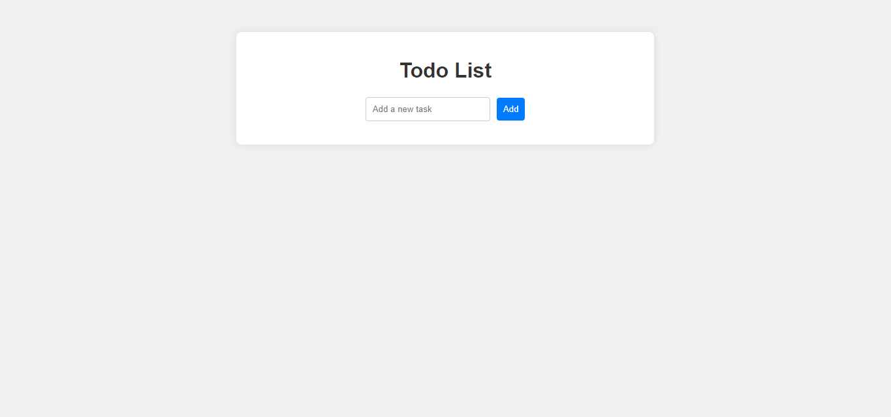
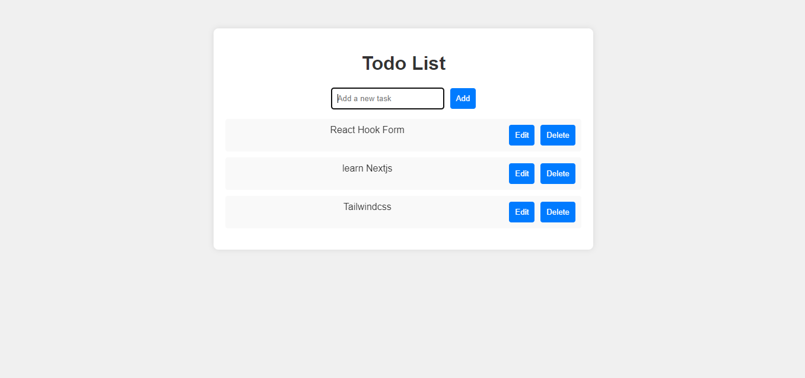
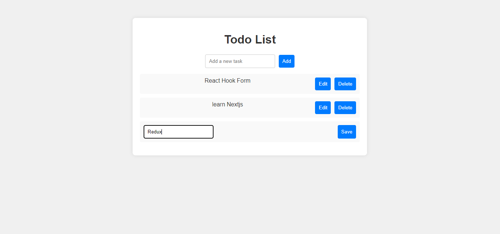

# Todo List App

This is a simple Todo List application built with React and TypeScript. It allows users to add, edit, and delete tasks.

## Features

- Add new tasks
- Edit existing tasks
- Delete tasks

## Installation

1. Clone the repository
   2.cd to todo-list-ts
2. Install dependencies: `npm install`

## Running the App

To run the app use: `npm run dev`

## Screen shot

The above image shows the home page that the users get when they run the app

The above image shows the task added with their edit and delete button

The above image shows the task being edited
